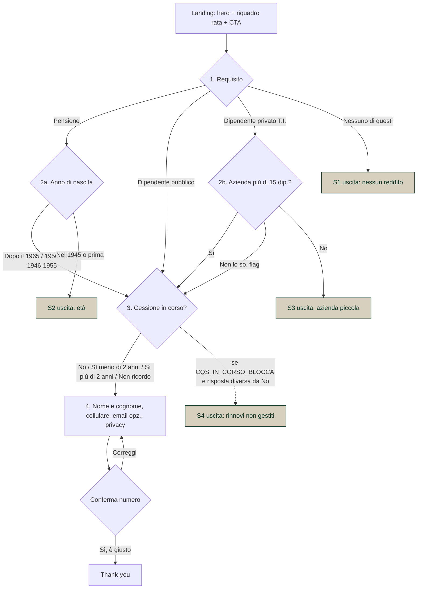

# Mappa del funnel corto (LP + quiz 4 step)

Documento di validazione per il buyer. Descrive ogni percorso, ogni uscita e ogni regola del prototipo `corto/index.html`. Per il funnel lungo vedi `MAPPA_FUNNEL.md`. Le soglie sono le stesse dei due funnel.

## Parametri (`CFG` in testa al file)

| Parametro | Valore attuale | Effetto |
|---|---|---|
| `MAX_AGE` | 81 | Solo pensionati. Fascia bloccante: nati nel (anno corrente − 81) o prima. Nel 2026: "Nel 1945 o prima". |
| `MIN_EMPLOYEES` | 16 | Azienda privata: la domanda è "più di 15 dipendenti?" |
| `CQS_IN_CORSO_BLOCCA` | false | Se true, ogni risposta diversa da "No" allo step 3 esce (S4) |
| `MAIL_REQUIRED` | false | Email facoltativa |
| `CALLBACK_SLA` | "entro 2 ore lavorative" | Promessa in form, TY, sezione "Come funziona", FAQ |
| `CONSULENTE` / `SOGGETTO` | segnaposto | Nome del consulente e soggetto OAM |
| `WHATSAPP` | vuoto | Numero del consulente; vuoto = bottone WhatsApp nascosto in TY |
| `ESEMPIO` | null | Esempio rappresentativo (importo, durata, rata, TAN, TAEG, totale, valido dal). null = segnaposto evidenziati |
| `ENDPOINT` | null | URL CRM; null = il lead va in console |

## Diagramma

## Percorsi validi (3)

| # | Percorso | Domande viste |
|---|---|---|
| P1 | Pensione → fascia non bloccante → cessione in corso → contatto | 4 |
| P2 | Dipendente pubblico → cessione in corso → contatto | 3 |
| P3 | Dipendente privato → azienda Sì o Non lo so → cessione in corso → contatto | 4 |

## Uscite (4). Nessun bottone, nessun "Ricomincia". Evento `quiz_out{reason}`.

| # | Dove | Condizione | `reason` | Titolo | Testo |
|---|---|---|---|---|---|
| S1 | Step 1 | Nessuno di questi | `nessun_reddito` | Con questo tipo di reddito il quinto non si può fare. | La rata viene trattenuta direttamente da una pensione o da uno stipendio a tempo indeterminato. Con contratti a termine, partita IVA, colf e badanti o senza reddito fisso il prodotto non è praticabile: te lo diciamo ora, non dopo averti fatto lasciare il numero. |
| S2 | Step 2a | Nato nel (anno − 81) o prima | `eta_max_pensionato` | Oltre gli 81 anni gli istituti non erogano il quinto sulla pensione. | Il limite riguarda l'età alla fine del piano di rimborso, ed è fissato dagli istituti convenzionati. Preferiamo dirtelo subito. |
| S3 | Step 2b | Azienda "No" | `piccola_azienda` | Sotto i 16 dipendenti gli istituti di solito non erogano. | La cessione del quinto si appoggia al datore di lavoro, che deve garantire la trattenuta: le aziende piccole non vengono accettate dalla maggior parte delle finanziarie. |
| S4 | Step 3 | Solo se `CQS_IN_CORSO_BLOCCA = true` e risposta ≠ No | `cqs_in_corso` | Con una cessione già attiva non possiamo procedere. | Il partner con cui lavoriamo oggi non gestisce rinnovi. Se la cessione finisce, torna pure. |

Ogni uscita chiude con: *Preferiamo dirtelo adesso, prima di chiederti il numero.*

## Cosa NON blocca (differenze dal lungo)

| Caso | Nel lungo | Nel corto | Perché |
|---|---|---|---|
| Tipo di pensione (invalidità, sociale) | Uscita X5/X6 | Non chiesto | Lo verifica il consulente; entra in v2 se i dati mostrano scarti |
| Anno di assunzione | Uscita X7 | Non chiesto | Idem |
| Reddito netto minimo | Uscita X9 | Non chiesto | Idem |
| Età dei dipendenti | Uscita X12 | Non chiesta | Chi lavora ha meno di 81 anni |
| Datore famiglia / autonomo | Uscite X3/X4 | Compresi in "Nessuno di questi" | Una domanda invece di due |
| CAP | Gate | Non chiesto | Un solo partner |
| Importo desiderato | Step 4 | Non chiesto | Non qualifica; lo chiede il consulente |
| Cessione in corso | Non blocca | Non blocca | Rinnovo = lead prezioso |

## Validazione step 4

| Campo | Regola | Messaggio se manca |
|---|---|---|
| Nome e cognome | ≥ 2 caratteri | *Per continuare manca: nome e cognome.* |
| Cellulare | inizia per 3, 9-10 cifre, +39 e spazi tollerati | *…il numero di cellulare.* / *…un numero di cellulare valido (inizia per 3, 9-10 cifre).* |
| Email | facoltativa; se presente deve essere valida | *…un'email valida.* |
| Privacy | obbligatoria | *…il consenso privacy.* |
| Marketing | facoltativa, separata, non pre-spuntata | |

Più mancanze insieme: *Per continuare manca: nome e cognome, il numero di cellulare e il consenso privacy.* Il primo campo mancante prende il focus.

Conferma numero: modal con il numero formattato, "Sì, è giusto" → invio; "correggi il numero" → torna al campo.

## Thank-you

*Fatto. Ti chiama [Consulente] entro [SLA].* · numero inserito · riepilogo (reddito; anno di nascita o azienda; cessione in corso) · documenti da tenere a portata di mano · bottone WhatsApp (solo se `WHATSAPP` valorizzato) · riga opt-out SMS. Nessun upsell.

## Eventi `dataLayer`

`lp_view` · `hero_cta_click` / `sticky_cta_click` / `bottom_cta_click` · `quiz_start` · `step_view{step}` · `answer{q,a}` · `quiz_out{reason}` · `phone_confirm{ok}` · `lead_submit{categoria,cqs_in_corso,email_present}` · `ty_view` · `ty_whatsapp`. Ogni evento porta `cp` (parametro URL `c=`, `fb=` o `utm_campaign`) e `variante` (parametro URL `v=`, default A). Il lead include tutti gli `utm_*` e `fbclid`.

## Checklist di test (12)

| # | Percorso | Atteso |
|---|---|---|
| T1 | Pensione → Dal 1946 al 1955 → No → dati → conferma | TY con riepilogo pensione |
| T2 | Pubblico → Sì da più di 2 anni → dati | TY, riepilogo "Sì, da più di 2 anni" |
| T3 | Privato → Sì → No → dati | TY |
| T4 | Privato → Non lo so → … | TY, riepilogo azienda "Da verificare" |
| T5 | Nessuno di questi | S1, nessun bottone |
| T6 | Pensione → Nel 1945 o prima | S2 |
| T7 | Privato → No | S3 |
| T8 | Step 4 vuoto → Fatti richiamare | "manca: nome e cognome, il numero di cellulare e il consenso privacy" |
| T9 | Cellulare "12345" | "un numero di cellulare valido (inizia per 3, 9-10 cifre)" |
| T10 | Modal numero → correggi | torna al campo cellulare |
| T11 | Indietro da step 3 | torna a 2a (pensione), 2b (privato), 1 (pubblico) |
| T12 | Mobile: scroll sotto il quiz | barra "Verifica se rientri" compare; sparisce su quiz, uscita e TY |

## Non implementato (prototipo)

Invio al CRM (`ENDPOINT`), pixel/CAPI, informativa privacy reale, testi OAM, esempio rappresentativo reale, numero WhatsApp, SMS di conferma. Tutti segnaposto tra parentesi quadre.
