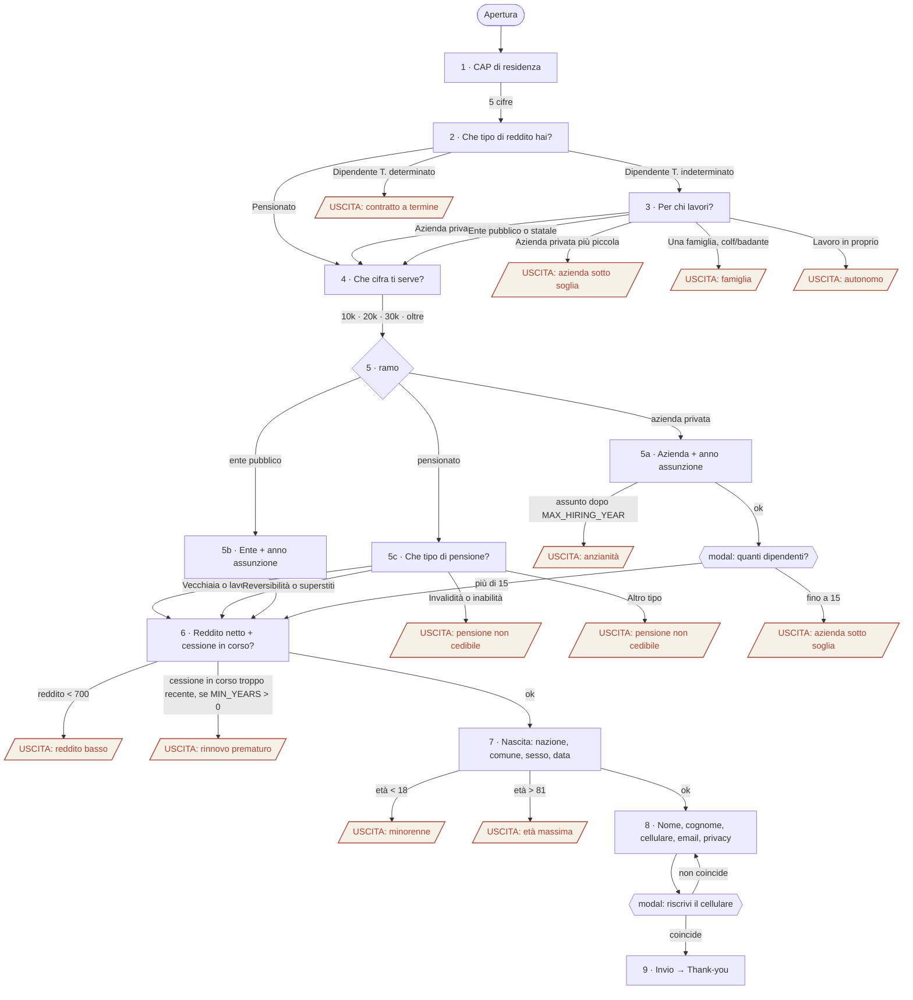

# Mappa delle diramazioni, funnel Cessione del Quinto

Documento di validazione per il buyer. Descrive **ogni percorso, ogni uscita e ogni regola** del prototipo `index.html`, così che si possa verificare la logica senza fare cento prove a mano.

Ogni soglia citata qui è un parametro in testa al file (`CFG`) e si cambia in un punto solo.

---

## 1. Parametri in vigore

| Parametro | Valore attuale | Cosa fa | Da confermare col partner |
|---|---|---|---|
| `MIN_INCOME` | 700 €/mese netti | sotto → uscita | sì |
| `MAX_AGE` | 81 anni compiuti | oltre → uscita, per tutti (dipendenti e pensionati) | sì |
| `MIN_EMPLOYEES` | 16 dipendenti | azienda privata sotto soglia → uscita | sì (il riferimento usa 9 o 16 a seconda della campagna) |
| `MAX_HIRING_YEAR` | anno corrente − 1 | assunti dopo → uscita (anzianità minima ≈ 1 anno) | sì |
| `MIN_YEARS_EXISTING_CQS` | 0 = non blocca | N = blocca se la cessione in corso ha meno di N anni; 100 = blocca sempre | sì: rinnovi accettati? |
| `MAIL_REQUIRED` | no | email facoltativa | — |
| `CALLBACK_SLA` | "entro 2 ore lavorative" | promessa nello step dati e in thank-you | sì, va mantenuta |
| `CONSULENTE` | "un consulente di [Soggetto]" | nome che compare in step dati e thank-you | sì |
| `ENDPOINT` | nessuno (simulato) | dove viene inviato il lead | sì |

---

## 2. Diagramma completo

Su GitHub il diagramma si vede renderizzato. Se non lo vedi, la stessa logica è nelle tabelle sotto.

---

## 3. I tre percorsi validi

### 3.1 Dipendente privato (percorso più lungo)

| Step | Domanda | Risposte che fanno proseguire | Risposte che fanno uscire |
|---|---|---|---|
| 1 | Dove abiti? (CAP) | 5 cifre | — |
| 2 | Che tipo di reddito hai? | Dipendente a tempo indeterminato | Tempo determinato |
| 3 | Per chi lavori? | Azienda privata con almeno 16 dipendenti | Azienda più piccola · Famiglia · Lavoro in proprio |
| 4 | Che cifra ti serve? | qualsiasi (10k / 20k / 30k / oltre) | — |
| 5a | Azienda + anno di assunzione | nome ≥ 2 caratteri, anno tra 1980 e oggi, ≤ anno corrente − 1 | assunto nell'anno corrente |
| 5a-bis | **Modal**: quanti dipendenti ha l'azienda? | Più di 15 | Fino a 15 |
| 6 | Netto mensile + cessione in corso? | ≥ 700 €, sì/no indicato | < 700 € · (cessione recente, solo se attivato) |
| 7 | Nazione, comune, sesso, data di nascita | tutti compilati, età 18–81 | < 18 · > 81 |
| 8 | Nome, cognome, cellulare, email (facolt.), privacy | tutti validi, privacy spuntata | — |
| 8-bis | **Modal**: riscrivi il cellulare | coincide | non coincide → resta sulla modal |
| 9 | Invio → **Fatto.** | — | — |

### 3.2 Dipendente pubblico / statale

Come sopra, con due differenze: allo step 3 sceglie *Ente pubblico o statale*, allo step 5 compila **ente + anno di assunzione** (5b) e **non passa** dal controllo anzianità né dalla modal dipendenti.

### 3.3 Pensionato

| Step | Domanda | Prosegue | Esce |
|---|---|---|---|
| 1 | CAP | 5 cifre | — |
| 2 | Che tipo di reddito hai? | Pensionato / pensionata | — |
| 3 | *(saltato)* | | |
| 4 | Che cifra ti serve? | qualsiasi | — |
| 5c | Che tipo di pensione percepisci? (**scelta singola, un tap e avanza**) | Vecchiaia o lavorativa · Reversibilità o superstiti | Invalidità o inabilità · Altro tipo |
| 6 | Pensione netta mensile + cessione in corso? | ≥ 700 € | < 700 € |
| 7 | Nascita | età 18–81 | > 81 |
| 8 → 9 | come sopra | | |

---

## 4. Tutte le uscite (12)

Ogni uscita è una modal **senza pulsanti**: si legge il motivo e non si può tornare indietro (per riprovare bisogna ricaricare la pagina, e si riparte dal CAP). Ogni uscita spara l'evento `quiz_out` con il `reason` indicato.

| # | Dove | Condizione | `reason` | Titolo mostrato | Testo mostrato |
|---|---|---|---|---|---|
| X1 | Step 2 | Tempo determinato | `determinato` | Con un contratto a termine il quinto non si può fare. | La rata viene trattenuta dallo stipendio per tutta la durata del piano: serve un contratto senza scadenza. Se in futuro passi a tempo indeterminato, torna pure. |
| X2 | Step 3 | Azienda privata più piccola | `piccola_azienda` | Sotto i 16 dipendenti gli istituti di solito non erogano. | La cessione del quinto si appoggia al datore di lavoro, che deve garantire la trattenuta: le aziende piccole non vengono accettate dalla maggior parte delle finanziarie. |
| X3 | Step 3 | Una famiglia (colf, badante) | `famiglia` | Per colf e badanti il quinto non è previsto. | Il datore di lavoro dev'essere un'azienda o un ente. Con una famiglia come datore la trattenuta non è possibile. |
| X4 | Step 3 | Lavoro in proprio | `autonomo` | Con la partita IVA il quinto non si può fare. | Non c'è uno stipendio da cui trattenere la rata. Esistono altre forme di finanziamento, ma non sono quelle di cui ci occupiamo qui. |
| X5 | Step 5c | Pensione di invalidità o inabilità | `pensione_inabilita` | Sulla pensione di invalidità o inabilità il quinto non si può fare. | La cessione si può fare sulle pensioni di vecchiaia, di anzianità e ai superstiti. Invalidità civile, assegno ordinario e accompagnamento non rientrano. |
| X6 | Step 5c | Altro tipo | `pensione_altro` | Su questo tipo di pensione il quinto non si può fare. | La cessione si può fare sulle pensioni di vecchiaia, di anzianità e ai superstiti. Pensione sociale e rendite INAIL non rientrano. |
| X7 | Step 5a | Anno di assunzione > anno corrente − 1 (solo azienda privata) | `anzianita` | Sei stato assunto da troppo poco. | Gli istituti chiedono un minimo di anzianità in azienda prima di valutare una cessione. Riprova più avanti: le regole non cambiano, il tempo sì. |
| X8 | Modal dopo 5a | Conferma "Fino a 15 dipendenti" | `piccola_azienda_conferma` | Sotto i 16 dipendenti gli istituti di solito non erogano. | *(come X2)* |
| X9 | Step 6 | Netto < 700 € | `reddito_basso` | Sotto i 700 € netti al mese la rata non è sostenibile. | Un quinto del netto sarebbe una cifra troppo bassa per qualsiasi piano: gli istituti non aprono la pratica. Non dipende da te, è un limite del prodotto. |
| X10 | Step 6 | Cessione in corso da meno di N anni (**oggi disattivata**, `MIN_YEARS_EXISTING_CQS = 0`) | `cqs_recente` / `cqs_in_corso` | La cessione in corso è troppo recente per un rinnovo. | Per legge il rinnovo è possibile dopo aver pagato almeno due quinti del piano. Con la tua data siamo sotto: riprova tra N anni. |
| X11 | Step 7 | Età < 18 | `minorenne` | Serve la maggiore età. | La richiesta può farla solo chi ha compiuto 18 anni. |
| X12 | Step 7 | Età > 81 | `eta_max` / `eta_max_pensionato` | Oltre gli 81 anni gli istituti non erogano il quinto (sulla pensione). | Il limite riguarda l'età alla fine del piano di rimborso, ed è fissato dagli istituti convenzionati. Preferiamo dirtelo subito. |

Sotto ogni uscita compare la riga: *Preferiamo dirtelo adesso, prima di chiederti il numero.*

---

## 5. Cosa NON blocca (per scelta o perché va deciso)

| Caso | Comportamento attuale | Nota |
|---|---|---|
| Cessione del quinto già in corso | prosegue; chiede mese/anno (facoltativi) | il rinnovo è un lead valido. Si può bloccare via `MIN_YEARS_EXISTING_CQS` |
| Importo richiesto | mai bloccante | serve solo al consulente |
| Ente pubblico + anno di assunzione recente | prosegue | il controllo anzianità è applicato solo alle aziende private, come nel riferimento |
| Modal dipendenti | solo aziende private | l'ente pubblico non ci passa |
| Nato all'estero | prosegue, non chiede il comune | |
| Email vuota | prosegue | `MAIL_REQUIRED = false` |
| CAP | accetta qualsiasi 5 cifre | nessuna verifica di copertura territoriale: da attivare solo se ci sono più partner per zona |
| Cessione recente con data "non ricordo" | prosegue anche se il blocco fosse attivo | si verifica al telefono |

---

## 6. Validazioni per campo (messaggi "cosa manca")

Ogni step con campi liberi elenca **esattamente** cosa manca, evidenzia i campi in rosso e porta il cursore sul primo. Formato: *"Per continuare manca: X, Y e Z."*

| Step | Controllo | Messaggio |
|---|---|---|
| 1 | CAP di 5 cifre | un CAP di 5 cifre |
| 5a/5b | nome ≥ 2 caratteri | il nome dell'azienda / dell'ente |
| 5a/5b | anno vuoto | l'anno di assunzione |
| 5a/5b | anno fuori 1980–oggi | un anno di assunzione tra 1980 e [anno corrente] |
| 6 | reddito vuoto o 0 | lo stipendio netto mensile / la pensione netta mensile |
| 6 | reddito ≥ 20.000 | un importo mensile realistico (sotto i 20.000 €) |
| 6 | sì/no non scelto | la risposta su una cessione in corso (sì o no) |
| 7 | comune vuoto (solo Italia) | il comune di nascita |
| 7 | sesso non scelto | il sesso |
| 7 | giorno non valido | il giorno di nascita |
| 7 | mese non scelto | il mese di nascita |
| 7 | anno vuoto / non 4 cifre | l'anno di nascita / un anno di nascita valido (4 cifre) |
| 8 | nome < 2 | il nome |
| 8 | cognome < 2 | il cognome |
| 8 | cellulare vuoto | il numero di cellulare |
| 8 | cellulare non valido | un numero di cellulare valido (9-11 cifre) |
| 8 | email presente ma non valida | un'email valida |
| 8 | privacy non spuntata | il consenso privacy |
| 8-bis | conferma vuota | il numero di cellulare, riscritto |
| 8-bis | conferma diversa | Il numero non corrisponde a quello inserito prima (…). Correggi qui, oppure torna indietro e correggi quello. |

Il numero viene normalizzato prima del confronto: spazi, trattini, `+39` e `0039` vengono ignorati.

---

## 7. Thank-you

Cosa vede chi arriva in fondo:

- **Fatto.**
- *Ti chiama [consulente] entro [SLA] al [numero confermato]. Una chiamata sola.*
- Riepilogo: tipo di reddito · cifra indicativa · cessione in corso sì/no · netto mensile
- Documenti da tenere a portata di mano: documento d'identità, codice fiscale, ultimo cedolino o certificato di pensione `[da verificare col partner]`
- *Se cambi idea prima della chiamata, rispondi "no grazie" all'SMS che ricevi: non ti richiamiamo.*

---

## 8. Checklist di test per il buyer

Ogni riga è un percorso da fare una volta sola. Colonna "Atteso" = cosa deve succedere.

| # | Percorso | Atteso |
|---|---|---|
| T1 | CAP `61029` → indeterminato → azienda ≥16 → 20k → "Stellantis" 2012 → modal "più di 15" → 2200, no → Urbino, M, 20/5/1985 → dati → riscrivi numero → | **Fatto.** con riepilogo "Dipendente T.I. privato · fino a 20.000 €" |
| T2 | CAP → indeterminato → ente pubblico → 10k → "Ministero" 2010 → 1800, no → nascita ok → dati | **Fatto.**, nessuna modal dipendenti |
| T3 | CAP → pensionato → 10k → vecchiaia → 1200, no → nascita ok → dati | **Fatto.** con "Pensione" |
| T4 | CAP → pensionato → 10k → reversibilità | prosegue allo step 6 |
| T5 | CAP → tempo determinato | X1 |
| T6 | CAP → indeterminato → azienda più piccola | X2 |
| T7 | CAP → indeterminato → famiglia | X3 |
| T8 | CAP → indeterminato → lavoro in proprio | X4 |
| T9 | CAP → pensionato → 10k → invalidità | X5 |
| T10 | CAP → pensionato → 10k → altro tipo | X6 |
| T11 | T1 ma anno assunzione = anno corrente | X7 |
| T12 | T1 ma nella modal scegli "fino a 15" | X8 |
| T13 | T1 ma reddito 650 | X9 |
| T14 | T1 ma anno nascita = anno corrente − 17 | X11 |
| T15 | T1 ma anno nascita = anno corrente − 82 | X12 |
| T16 | T3 ma anno nascita = anno corrente − 81 | prosegue (81 compiuti è ammesso) |
| T17 | T1 ma allo step 7 non scegliere il sesso e non il mese | messaggio: *manca: il sesso e il mese di nascita* |
| T18 | T1 ma allo step 8 privacy non spuntata | messaggio: *manca: il consenso privacy* |
| T19 | T1 ma nella modal numero scrivi un numero diverso | resta sulla modal con messaggio di non corrispondenza |
| T20 | T1 ma allo step 6 cessione in corso = sì, senza data | prosegue (con `MIN_YEARS_EXISTING_CQS = 0`) |
| T21 | Su una qualsiasi uscita, cercare un pulsante | non c'è: per riprovare si ricarica la pagina |
| T22 | Bottone "← indietro" su ogni step da 3 a 8 | torna allo step precedente, risposte già date restano in memoria |

---

## 9. Non ancora implementato

- Autocomplete aziende (Registro Imprese) e comuni: oggi campi liberi. In pausa, da decidere col buyer.
- Verifica copertura territoriale sul CAP: accetta tutto.
- Invio reale al CRM: `ENDPOINT` vuoto, il lead viene loggato in console del browser.
- Footer con ragione sociale, OAM e mandante: placeholder.
- Landing sopra il quiz (hero + riquadro rata a norma art. 123 TUB): il prototipo parte dal CAP come il funnel di riferimento.
